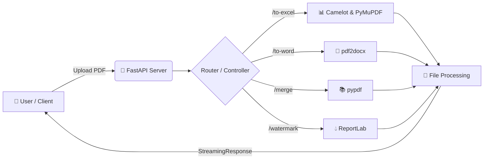

# 📄 BigPDF Backend API


> **All-in-One PDF Manipulation Tool**  
> Backend API berkinerja tinggi untuk mengolah, mengonversi, dan memodifikasi PDF.  
> Dibangun dengan **FastAPI** & pustaka Python modern.

---

## 🏗️ Arsitektur & Alur Kerja



---

## ✨ Fitur Utama

### 🔄 Konversi
| Fitur | Deskripsi |
|------|-----------|
| PDF → Word | Konversi PDF ke `.docx`. |
| PDF → Images | Ekstrak halaman menjadi gambar (ZIP). |
| PDF → Excel | Ekstrak tabel, termasuk gambar dalam sel. |
| PDF → PPT | Konversi halaman PDF ke slide PowerPoint. |

### 🧩 Organisasi
| Fitur | Deskripsi |
|------|-----------|
| Merge PDF | Menggabungkan banyak PDF. |
| Split PDF | Memisahkan PDF berdasarkan rentang halaman (`1-3,5`). |
| Delete Pages | Menghapus halaman tertentu. |
| Arrange Pages | Mengatur ulang urutan halaman (`3,1,2`). |

### 🛡️ Edit & Keamanan
| Fitur | Deskripsi |
|------|-----------|
| Watermark | Tambah watermark teks transparan. |
| Signature | Tambah gambar tanda tangan (koordinat X,Y). |
| Rotate | Putar halaman 90°, 180°, 270°. |
| Lock/Unlock | Enkripsi dan dekripsi PDF. |

---

## 🛠️ Teknologi yang Digunakan

- **FastAPI**, **Uvicorn**
- **pypdf**
- **pdf2docx**
- **pdf2image**
- **Camelot + PyMuPDF**
- **ReportLab**, **Pillow**
- **python-pptx**

---

## ⚙️ Instalasi & Prasyarat

### 1️⃣ System Dependencies

#### Poppler
- Windows: install Poppler & tambahkan `bin/` ke PATH  
- Linux:
```bash
sudo apt-get install poppler-utils
```

#### Ghostscript
- Windows: install Ghostscript  
- Linux:
```bash
sudo apt-get install ghostscript
```

---

### 2️⃣ Python Setup

```bash
# Clone repository
git clone https://github.com/username-anda/BigPDF-Backend.git
cd BigPDF-Backend

# Virtual environment
python -m venv venv

# Aktivasi
venv\Scripts\activate   # Windows
source venv/bin/activate  # Linux/Mac

# Install dependency
pip install fastapi uvicorn python-multipart pypdf pdf2docx pdf2image Pillow reportlab python-pptx camelot-py[cv] pandas openpyxl pymupdf
```

---

## 🚀 Menjalankan Server

```bash
uvicorn convert_pdf:app --host 0.0.0.0 --port 8000 --reload
```

Buka dokumentasi:  
👉 http://localhost:8000/docs

---

## 📖 Contoh API: Tambah Tanda Tangan

```bash
curl -X POST "http://localhost:8000/add-signature" \
  -H "accept: application/pdf" \
  -H "Content-Type: multipart/form-data" \
  -F "file=@dokumen_kontrak.pdf;type=application/pdf" \
  -F "signature_image=@ttd_saya.png;type=image/png" \
  -F "page_number=1" \
  -F "x_pos=100" \
  -F "y_pos=200" \
  -F "width=150"
```

---

## 🤝 Kontribusi

1. Fork repo  
2. Buat branch  
3. Commit  
4. Push  
5. Pull request  

---

## 📝 Lisensi

MIT License.

<div align="center">
Made with ❤️ by <a href="https://github.com/username-anda](https://github.com/YeQiu29">Dennis Putra Hilmansyah</a>
</div>
